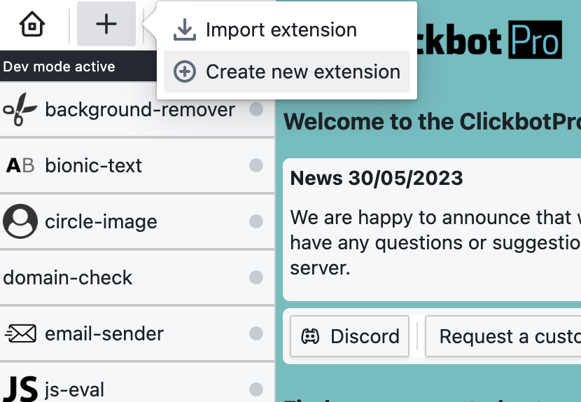
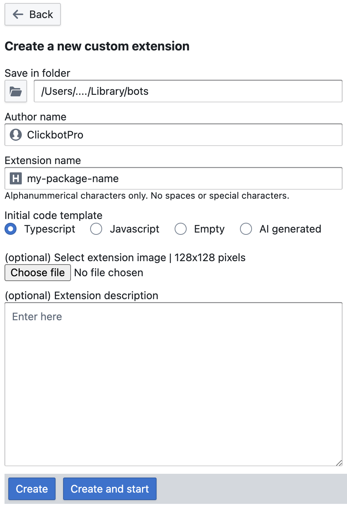

## About ClickbotPro


ClickbotPro is a desktop application with a ton of preconfigured bots that you can run for free. 
You can define different conditions for a bot to start, such as time of day, system startup, or a file change. You can chain bots together to create complex workflows. 
You can run the bots completely in the background without disturbing you. 
We have simple click bots that merely move and click your mouse. Additionally, we have advanced bots that can fill out forms, log in to websites, and perform many other tasks.

# ClickbotPro Client SDK

The ClickbotPro Client SDK is a library designed for interacting with a running instance of the ClickbotPro application. You can create your own Node.js packages using this SDK and execute them either through the application or via the regular Node.js CLI.

## Installation

Use npm to install cbp-client.

```bash
npm i cbp-client
```

## Usage

Typescript
```typescript
import CbpClient from 'cbp-client';
const client = new CbpClient();
const logger = client.logger;
(async()=>{
    try {
        await client.connect();//connect() requires you to have a running ClickbotPro instance.
        //continue here ...
        //
    } catch (e:any) {
        await logger.error(e.message);
    } finally {
        await client.disconnect();
    }
})();
```

Javascript
```javascript
const sdk = require('cbp-client');
const client = new sdk.default();
const logger = client.logger;
(async()=>{
    try {
        await client.connect();//connect() requires you to have a running ClickbotPro instance.
        //continue here ...
        //
    } catch (e) {
        await logger.error(e.message);
    } finally {
        await client.disconnect();
    }
})();
```
## Alternative usage

Use the ClickbotPro application to create bots from predefined templates, instead of manually creating a Node.js project.

Click the + button



Select any template and click the create button



## Other sources

[ClickbotPro website](https://clickbot.pro)

[Discord server](https://discord.gg/CNh88zDTPh)

## License

[MIT](https://choosealicense.com/licenses/mit/)